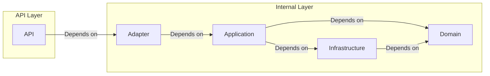

# IAM (Identity and Access Management) Module

## Introduction

This module is a single-tenant Identity and Access Management (IAM) service designed as a learning project to explore
best practices in modern Java/Kotlin development. It leverages **Spring Boot 4.x**, **Kotlin 2.3**, and **JDK 25**,
structured using **Spring Modulith** principles to ensure modularity, maintainability, and clear boundary definitions.

The primary goal of this project is to evolve incrementally via Git, implementing core IAM features (Authentication,
Authorization, User Management) while adhering to clean architecture and domain-driven design (DDD) concepts.

## Tech Stack

- **Runtime**: JDK 25
- **Framework**: Spring Boot 4.x
- **Language**: Kotlin 2.3
- **Architecture**: Modular Monolith

## Features Plan (Planned for incremental implementation)

1. Threat Model & Security Baseline (威胁模型与安全基线)
    - **Assets & Data Classification:** Enumerate assets (PII, credentials, tokens, audit logs) and define
      retention/redaction rules.
    - **Trust Boundaries:** Map public endpoints (login/register/reset) and internal dependencies (Redis, DB, SMS/Email
      providers) with explicit trust boundaries.
    - **Default Deny:** Treat all endpoints as protected by default; maintain an explicit allowlist for public
      endpoints.
    - **Failure Semantics:** Standardize error codes/messages; avoid account enumeration in both response body and
      timing.
    - **Security Test Matrix:** Map each baseline rule to automated tests (authorization, CSRF/CORS, rate limit,
      lockout, token replay, log redaction).
2. Core Authentication & Login (核心认证与登录)
    - **Secure Transport:** Terminate TLS at gateway/reverse-proxy; enforce HTTPS, HSTS, and secure cookie attributes
      centrally.
    - **Spring Security Baseline:** Define a single SecurityFilterChain, explicit authorization rules, CORS allowlist,
      and CSRF strategy based on session mechanism.
    - **Credential Handling:** Never store plain-text passwords. Use Argon2id (preferred) or BCrypt with explicit work
      factors and per-password salts.
    - **Brute Force Protection:** Apply IP + account based throttling and lockout; include reset rules and audit trails.
    - **Generic Errors:** Use generic error responses (e.g., "Invalid username or password") and consistent response
      time to mitigate enumeration.
3. User Registration & Account Activation (用户注册与激活)
    - **Input Validation:** Strong server-side validation for email/phone formats, password complexity policy, and
      username constraints.
    - **Activation Tokens:** Use time-limited, single-use activation tokens; store only hashed tokens in DB.
    - **Unique Constraints:** Enforce unique constraints at the DB level (email/username/phone) with safe error handling
      to prevent enumeration.
    - **Verification Binding:** Require email/SMS verification before activating accounts (links to Phase 3).
4. Multi-Channel Verification Codes (多通道验证码)
    - **Channel Support:** Support Email and SMS as primary channels; TOTP is handled as MFA (Phase 6).
    - **Purpose Binding:** Bind codes to purpose (register/login/reset), receiver (email/phone), and client context;
      single-use consumption.
    - **Replay & Abuse Controls:** Strict rate limits (IP + receiver + device), short TTL (5–10 min), limited
      verification attempts, and exponential backoff.
    - **Idempotent Send:** Require an idempotency key to prevent repeated sends and billing surprises.
    - **Async Delivery:** Prefer outbox/event-driven delivery to providers with retry/backoff and circuit breaker.
    - **Code Security:** Use cryptographically secure random number generators.
5. Session & Token Management (会话与令牌管理)
    - **Session Strategy:** Prefer short-lived stateless JWTs (access tokens) + server-side refresh tokens (Redis).
    - **Refresh Token Rotation:** Implement rotation and reuse detection; store refresh tokens as hashes and support
      global logout.
    - **Secure Cookies:** If using cookie-based sessions, enforce HttpOnly, Secure, and SameSite=Strict attributes.
    - **Session Fixation Protection:** Regenerate session IDs upon successful login.
    - **Concurrent Session Control:** Limit active sessions per account, provide device visibility, and support explicit
      revocation for compromised sessions.
    - **JWT Hygiene:** Minimal claims, strict validation (iss/aud/exp/nbf), clock skew handling, and unique
      identifiers (jti) where needed.
6. Risk Control & Bot Prevention (风控与防机器人)
    - **Signals First:** Start with lightweight signals (login failures, IP reputation, suspicious geo-velocity) before
      heavy device fingerprinting.
    - **Progressive Challenge:** Trigger challenges only on suspicious signals (high failure rate, new device, unusual
      location), not by default.
    - **CAPTCHA Options:** Keep a pluggable challenge interface (behavioral slider/click as default, graphical as
      fallback) for low-friction verification.
    - **PoW (Optional):** Consider client-side Proof of Work only for extreme traffic/resource exhaustion scenarios.
    - **Step-Up Auth:** Enforce step-up (TOTP/CAPTCHA) on high-risk actions (password change, email/phone change, new
      device).
    - **Privacy by Design:** Define what risk data is collected, how it is hashed/anonymized, and its retention/deletion
      policies.
7. Multi-Factor Authentication (MFA / 多因素认证)
    - **MFA (TOTP):** Support optional TOTP as the first step-up mechanism (Standard Authenticator Apps).
    - **Passwordless (WebAuthn):** Add WebAuthn/FIDO2 as a later-stage credential type (biometric/hardware-key) with
      robust recovery flows.
8. Authorization & Standards (授权与开放标准)
    - **RBAC First:** Implement Role-Based Access Control with clear role-permission mapping.
    - **ABAC Extension:** Add Attribute-Based Access Control only when real policy complexity appears.
    - **OAuth2 / OIDC Integration:** Add as a later milestone; require PKCE for public clients and strict ID token
      validation.
    - **Security Headers:** Manage HSTS/CSP/X-Content-Type-Options centrally (gateway or Spring Security) with
      environment-specific config.
9. Audit, Observability & Engineering Quality (审计、可观测性与工程质量)
    - **Audit Logging:** Separate security audit from application logs; include correlationId/traceId; NEVER log
      passwords, codes, tokens, or secrets.
    - **Actuator Hardening:** Minimize exposed Spring Boot Actuator endpoints and secure them; treat metrics/loggers/env
      endpoints as privileged.
    - **Modulith Boundaries:** Use spring-modulith-starter-test to enforce module boundaries and allowed dependencies.
    - **Quality Gates:** Add ktlint/detekt and test layering (unit/module/integration); use Testcontainers for DB/Redis
      integration tests.
    - **Supply Chain:** Dependency scanning and SBOM (Software Bill of Materials) generation as CI checks; avoid
      committing secrets, use env/config injection (Vault/K8s secrets).

## Best Practice: Spring Modulith Module Structure

This project follows a strict layered architecture within the module to separate concerns and enforce dependency rules.
The structure is divided into a public **API** layer (for inter-module contracts) and an **Internal** implementation
layer.

```text
Module
├── api/                        # 1. Contract Layer (Public API) - Allowed for other modules to depend on
│   ├── dto/                    # Data Transfer Objects
│   │   ├── command/            # Write Commands (e.g., CreateXxxCmd)
│   │   ├── query/              # Read Queries (e.g., XxxQuery)
│   │   └── result/             # Response Results (e.g., XxxResult, XxxView)
│   ├── event/                  # Integration Events (Domain events published externally)
│   └── facade/                 # Local Facade Interfaces (Interfaces for cross-module calls)
│
└── internal/                   # 2. Internal Implementation Layer - Strictly private to this module
    │
    ├── adapter/                # 2.1 Inbound Adapters (Primary Ports)
    │   ├── facade/             # Implementations of api/facade interfaces
    │   ├── web/                # REST Controllers
    │   ├── messaging/          # Inbound Message Consumers
    │   └── scheduler/          # Scheduled Jobs
    │
    ├── application/            # 2.2 Application Layer (Use Cases)
    │   ├── command/            # Write Operation Services (CmdService)
    │   ├── query/              # Read Operation Services (QueryService)
    │   ├── event/              # Event Handlers (Listening to internal or external events)
    │   ├── assembler/          # Mappers between DTOs and Domain Models
    │   └── port/out/           # Application-level Outbound Ports (Non-core dependencies like Cache, Token)
    │
    ├── domain/                 # 2.3 Domain Layer (Core Business Logic) - No framework dependencies
    │   ├── model/              # Aggregates, Entities, Value Objects (Sub-packages by Aggregate)
    │   ├── service/            # Domain Services (Core business rules spanning multiple entities)
    │   ├── event/              # Internal Domain Events
    │   ├── repository/         # Repository Interfaces (Persistence Contracts)
    │   └── port/out/           # Domain-level Outbound Ports (ACL Interfaces for external systems)
    │
    └── infrastructure/         # 2.4 Infrastructure Layer (Outbound Adapters)
        ├── persistence/        # Persistence Implementations (Strict Data Source Isolation)
        │   ├── entity/         # JPA Entities / Database Tables
        │   ├── jpa/            # Spring Data JPA Repositories
        │   ├── mapper/         # ORM Mappers
        │   └── repository/     # Repository Implementations
        ├── integration/        # External System/API Gateway Implementations (ACL Concrete Classes)
        ├── cache/              # Cache Implementations (Redis, etc.)
        ├── messaging/          # Outbound Message Publishing (Outbox Pattern, RabbitMQ, Event Bus)
        └── config/             # Module-specific Spring Configurations (DataSource, Redis, OpenAPI, etc.)
```

### Dependency Rules

1. **API Layer (`api/`)**:
   - **Visibility**: Public. Can be shared and depended upon by other modules.
   - **Dependencies**: Should have minimal dependencies, typically only standard libraries or common DTO bases. It must
     **not** depend on any `internal` packages.

2. **Internal Layer (`internal/`)**:
   - **Visibility**: Private. Strictly internal to this module; **cannot** be accessed by other modules.
   - **Sub-layer Dependencies**:
      - **Adapter (`adapter/`)**: Can depend on `api` (to implement facades or map DTOs) and `application` (to invoke
        use cases). It acts as the entry point for external requests.
      - **Application (`application/`)**: Can depend on `domain` (to execute business logic) and `infrastructure` (via
        outbound ports/interfaces defined in domain or application layers for technical concerns like caching or
        messaging). It orchestrates use cases.
      - **Domain (`domain/`)**: The core business logic layer. It **must not** depend on Spring Framework,
        infrastructure implementations, or any other layer (`api`, `application`, `adapter`). It depends only on
        itself (entities, value objects, domain services) and pure Java/Kotlin libraries.
      - **Infrastructure (`infrastructure/`)**: Implements technical details (persistence, external APIs). It depends
        on `domain` (to implement repository interfaces or map entities) and may use Spring/Framework-specific
        libraries.


